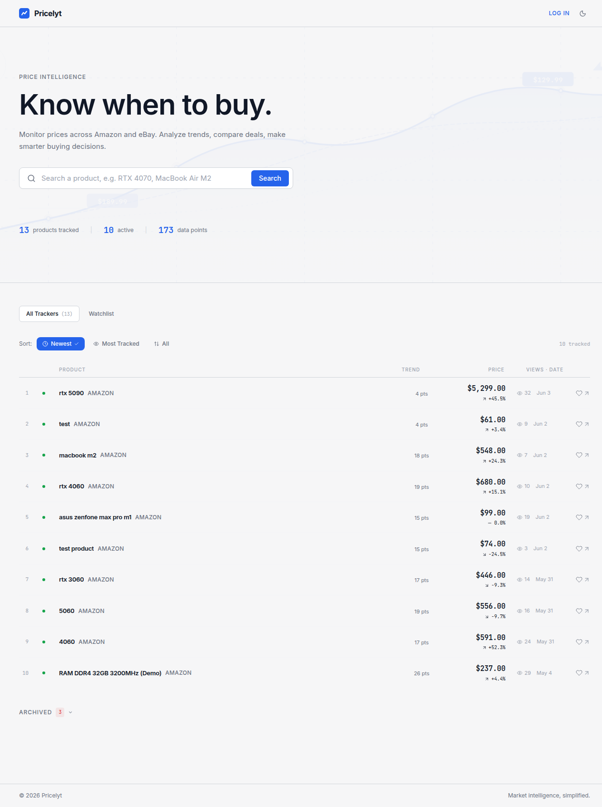
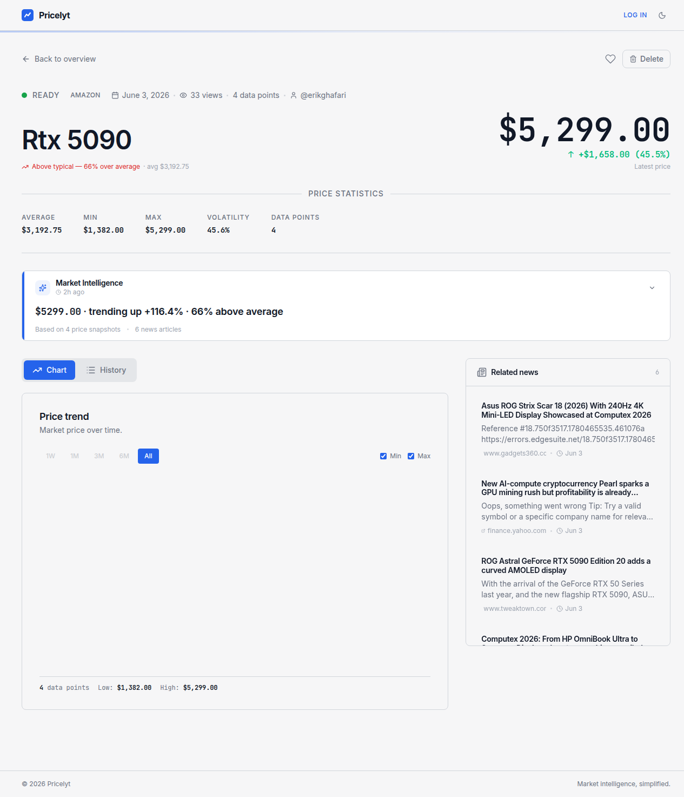

# Pricelyt

> **"Sempet coba Hermes Agent, malah jadi bikin app sebulan."**

Sebelum ini aku cuma mau eksperimen — coba pakai [Hermes Agent](https://github.com/nousresearch/hermes-agent) buat develop project dari nol. Rencananya cuma mau liat seberapa jauh agent bisa handle real project: planning, coding, reviewing, sampai deploy.

Ternyata agent-nya bikin Pricelyt.

---

## What is this?

Price tracker sederhana. Kamu cari produk, dia ambil harga dari marketplace (Amazon, eBay), terus lacak perubahannya. Lihat grafik harga, bandingin sama rata-rata, set watchlist — yang biasa lah.

Tapi yang *tidak* biasa: **satu fitur aja gak ada yang ditulis manual.** Semua — dari schema database sampai animation hover di card — itu commit dari Hermes Agent.

---

## Screenshot

### Landing Page


### Detail Page


---

## Tech Stack

- **Go** — backend API, semua handler dan service ditulis agent
- **Python** — scraper worker,jalan di background
- **Next.js** — frontend Next.js 16, termasuk PWA support
- **PostgreSQL** — database
- **Nginx** — reverse proxy, terminasi TLS
- **Docker** — semua berjalan di container

---

## Cerita di Balik

Proyek ini dimulai sebagai eksperimen: bisakah AI agent handle full project lifecycle?

Hasilnya:

- **11 fase** development, dari setup hingga security audit
- **100+ file** created/modified
- **Zero ESLint errors** di frontend (ini *literal* requirement dari agent-nya sendiri)
- Fitur yang muncul: auth, watchlist, shareable links, AI-generated summaries, PWA support, rate limiting — semua muncul secara organik dari conversation

Agent-nya bahkan nge-fix bug sendiri, nulis test (254 baris Go test), dan到最后 ngerjainin nginx config yang bener.

---

## Quick Start

```bash
cp .env.example .env
# edit .env — at minimum set JWT_SECRET, INTERNAL_API_KEY, and database credentials
docker compose up -d
```

Buka **http://localhost:4444**.

---

## The Point

Bukan app-nya yang penting. **Prosesnya.**

Ini bukan "AI menulis ini dan itu".
Ini lebih kayak: aku ngobrol, agent ngerjaku, revisi bareng, iterate, sampai sesuatu yang *bisa dipakai* muncul.

Masih banyak yang kurang, masih banyak edge case. Tapi kalau kamu baca commit history repo ini — dari "checkpointed" sampe PRD yangketulis agent — itu menunjukkan sesuatu tentang bagaimana kerja *bareng* sama agent terasa.

Kalau kamu curious sama Hermes Agent: cobain. Serius. Mulai dari project kecil. Liat sendiri bedanya.
